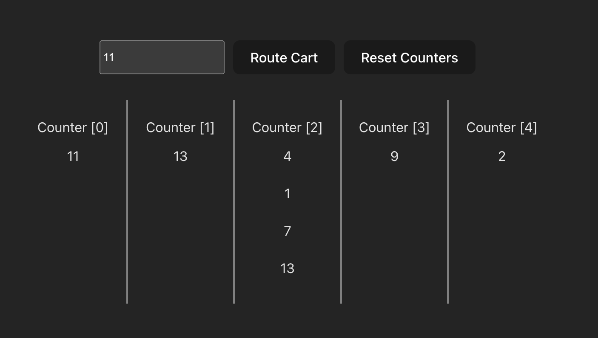

# Fun shopping cart routing challenge [SOLVED]

Find the counter with least amount of items in queue and direct the new shopping cart there. Also, have reset function to reset the number of counters as well as people in queue and number of items in their carts.

Challenge is inspired by this youtube video. https://www.youtube.com/watch?v=B9fmr1TpKHE&t=839s

## Getting started
<code>git clone</code> 

<code>cd checkout-cart-router</code>

<code>npm run dev</code>

## Start with Vite
<code>npm create vite@latest checkout-cart-router -- --template react-ts</code>

<code>cd checkout-router</code>

<code>npm install</code>

<code>npm run dev</code>
